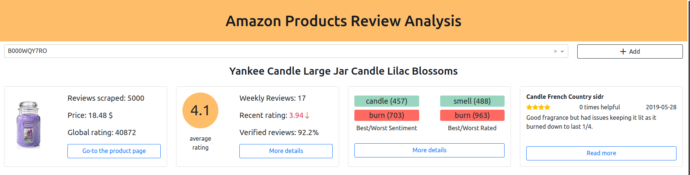
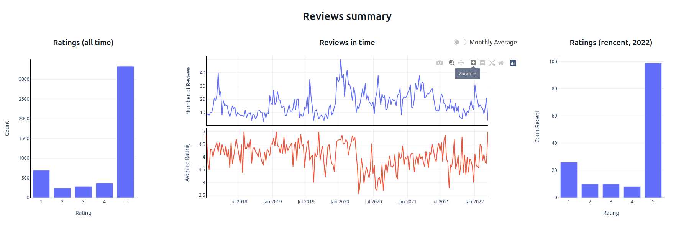
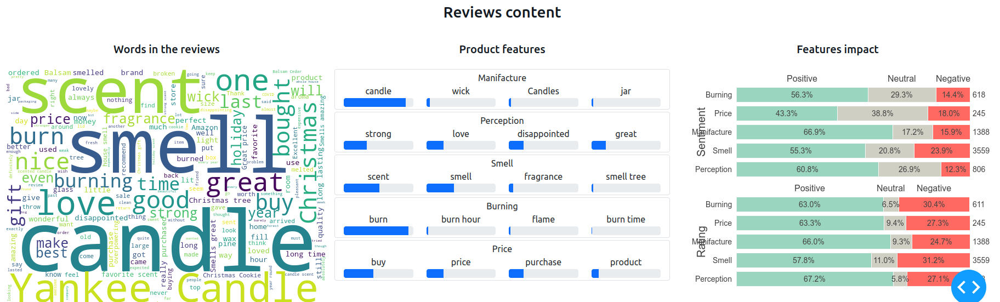

# Data visualization - Dashboard

We display the data we collected and analyzed in a simple dashboard developed using `dash`. The aspect extraction and clustering is too slow to be performed live. Therefore, all the data is pre-analyzed using the module `data_preprocess` to provide a better user experience.

The dashboard is divided into three different sections on the same page. The first section consists of a dropdown where you can select the product and a set of 4 cards that display general information about the product.

The second section provides a general analysis (distribution, time evolution - monthly and weekly) of the reviews rating.

The last section displays the product features we extracted from the reviews, the groups we detected (the names are hand-picked), and the average ratings and sentiment distribution associated with those groups.

