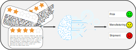

# SentimentAnalysisAmazonMerchant


# Business problem

Sentiment analysis aims at dentifying and categorize the sentiment in piece of text.

```
It has a wide range of applications in industry from
forecasting market movements based on sentiment expressed in news and blogs, to identifying
customer satisfaction and dissatisfaction from their reviews and social media posts. It also forms
the basis for other applications like recommender systems.

Consumers can also assign a numerical value (i.e., rating) to the product
or service they are reviewing. On Amazon.com the rating can be between 1 and 5 where 1 is the
worst and 5 is the best. In some instances, there is a mismatch between a customer’s review and
rating. It is important to identify the reviews with mismatched ratings since individual ratings are
used to compute the average rating.
```

# Setup

Create virtual environment and activate it
`python3 -m venv scraper-env`

`source scraper-env/bin/activate`

Install dependencies
`pip install -r requirements.txt`

Scrape the data
`python amazon_scrape.py`

export PYTHONPATH='/home/pdona/VariousExercises/SentimentAnalysisAmazonMerchant'

proof of concept, design can be improved (colors all over the place), ML can be improved (should train in review specific datasets)
