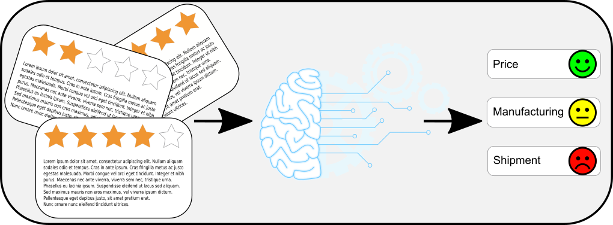

# Product Analysis from amazon reviews

# Business problem

A business needs to get feedback on its products to improve them and grow sales. Collecting those feedback is, in general, expensive and time-consuming. The majority of online marketing websites contain reviews on the product sold on the platform. This data collection is invaluable for a business and provides considerable insights if collected and appropriately analyzed.

# The proposal

We provide an application that collects the reviews of the desired product from `www.amazon.com`, analyzes them using NLP and clustering machine learning methods to extract from the reviews feedback on aspects of the product, and displays the result in a dashboard.

This is proof of concept and not a commercial product. In particular, many aspects of the project can be improved:

-   The design of the dashboard (the colors all over the place)
-   The aspect-based sentiment analysis can be improved (we should train on review specific datasets)

# Setup

Create virtual environment and activate it
`python3 -m venv scraper-env`

`source scraper-env/bin/activate`

Install the dependencies
`pip install -r requirements.txt`

Export the current directory to PYTHONPATH

`export PYTHONPATH=$PYTHONPATH:/path/to/this/dir`

If you want to prepare some example data run

`python get_sample_data.py`

If you want to collect the reviews of a specific product, make sure you know the ASIN number and run

`python add_product.py`

If you have the data analyzed, you can run the dashboard with

`python Dashboard/app.py`

and visit the [webpage](http://127.0.0.1:8050/).

# Data collection

[Click here for the data collection details](ProductReviews/README.md)

# Aspect extraction

[Click here for the aspects extractions details](SentimentAnalysis/README.md)

# Dashboard visualization

[Click here for the dashboards details](Dashboard/README.md)
